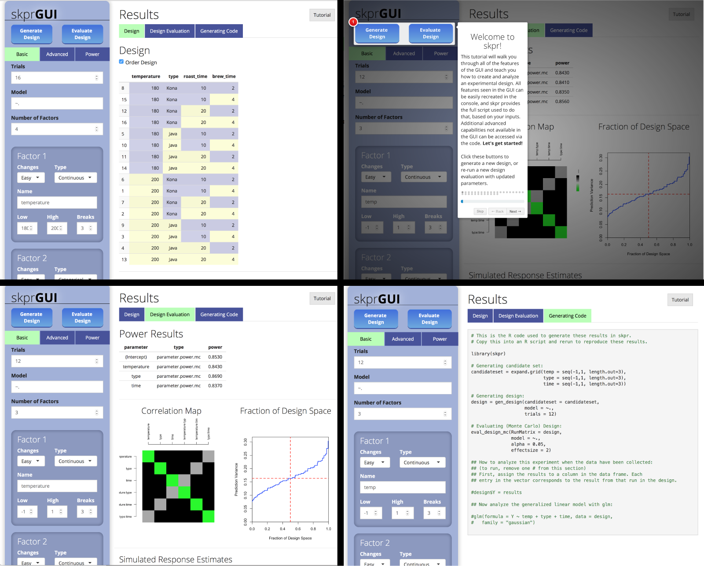

```{r, echo = FALSE}
knitr::opts_chunk$set(
  collapse = TRUE,
  comment = "#>",
  fig.path = "README-"
)
```

# skpr 

[](https://travis-ci.org/tylermorganwall/skpr)
[](https://cran.r-project.org/package=skpr)
[](https://github.com/tylermorganwall/skpr/actions)

</img>

## Overview

**skpr** is an open source design of experiments suite for generating and evaluating optimal designs in R. Here is a sampling of what skpr offers: 

* Generates and evaluates D, I, A, Alias, E, T, and G optimal designs, as well as user-defined custom optimality criteria. 
* Supports generation and evaluation of split/split-split/.../N-split plot designs. 
* Includes parametric and Monte Carlo power evaluation functions, and supports calculating power for censored responses. 
* Provides an extensible framework for the user to evaluate Monte Carlo power using their own libraries. 
* Includes a Shiny graphical user interface, skprGUI, that auto-generates the R code used to create and evaluate the design to improve ease-of-use and enhance reproducibility.

## Installation

```{r, eval=FALSE}
# To install:
install.packages("skpr")

# To install the latest version from Github:
# install.packages("devtools")
devtools::install_github("tylermorganwall/skpr")
```

## Functions

* `gen_design()` generates optimal designs from a candidate set, given a model and the desired number of runs.
* `eval_design()` evaluates power parametrically for linear models, for normal and split-plot designs.
* `eval_design_mc()` evaluates power with a Monte Carlo simulation, for linear and generalized linear models. This function also supports calculating power for split-plot designs using REML. 
* `eval_design_survival_mc()` evaluates power with a Monte Carlo simulation, allowing the user to specify a point at which the data is censored.
* `eval_design_custom_mc()` allows the user to import their own libraries and use the Monte Carlo framework provided by skpr to calculate power.
* `skprGUI()` and `skprGUIbrowser()` opens up the GUI in either R Studio or an external browser.

If addition, the package offers two functions to generate common plots related to designs:

* `plot_correlations()` generates a color map of correlations between variables.
* `plot_fds()` generates the fraction of design space plot for a given design.

##skprGUI
 
skprGUI provides an graphical user interface to access all of the main features of skpr. An interactive tutorial is provided to familiarize the user with the available functionality. Type `skprGUI()` or `skprGUIbrowser()` to begin. Screenshots:

</img>


## Usage

```{r, include=FALSE}
set.seed(2)
```

```{r example, message = FALSE}
library(skpr)

#Generate a candidate set of all potential design points to be considered in the experiment
#The hypothetical experiment is determining what affects the caffeine content in coffee
candidate_set = expand.grid(temp = c(80,90,100), 
                            type = c("Kona","Java"),
                            beansize = c("Large","Medium","Small"))
candidate_set

#Generate the design (default D-optimal)
design = gen_design(candidateset = candidate_set, 
                    model = ~temp + type + beansize,
                    trials=12)
design

#Evaluate power for the design with an allowable type-I error of 5% (default)
eval_design(design)

#Evaluate power for the design using a Monte Carlo simulation. 
#Here, we set the effect size (here, the signal-to-noise ratio) to 1.5.
eval_design_mc(design, effectsize=1.5)

#Evaluate power for the design using a Monte Carlo simulation, for a non-normal response. 
#Here, we also increase the number of simululations to improve the precision of the results.
eval_design_mc(design, nsim=5000, glmfamily = "poisson", effectsize=c(2,6))

#skpr was designed to operate with the pipe (%>%) in mind. 
#Here is an example of an entire design of experiments analysis in three lines:

expand.grid(temp = c(80,90,100), type = c("Kona","Java"), beansize = c("Large","Medium","Small")) %>%
  gen_design(model = ~temp + type + beansize + beansize:type + I(temp^2), trials=24, optimality="I") %>%
  eval_design_mc()

```
