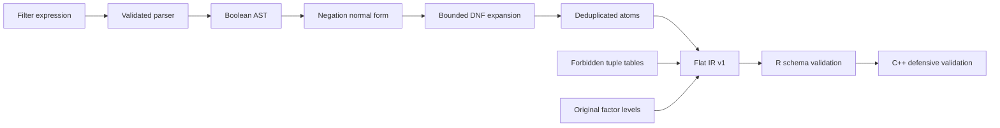
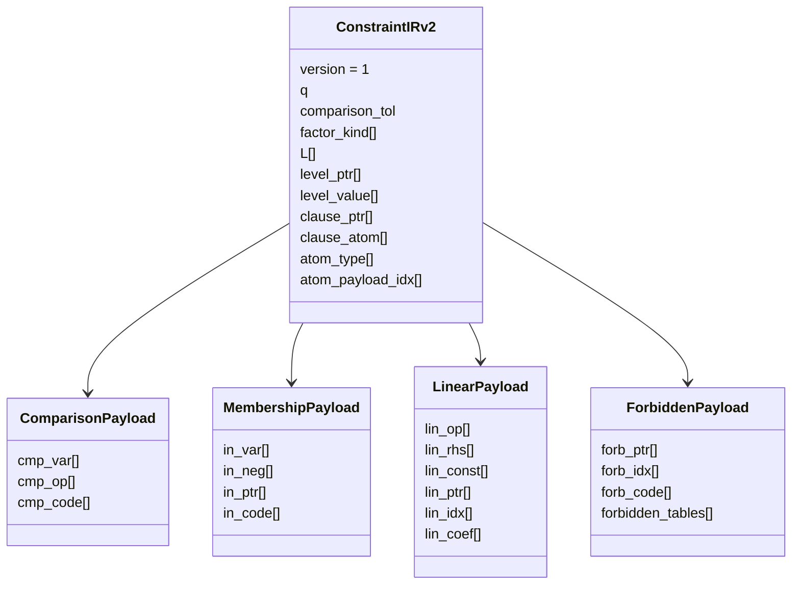
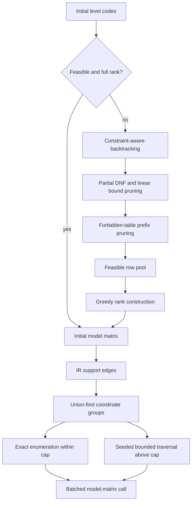
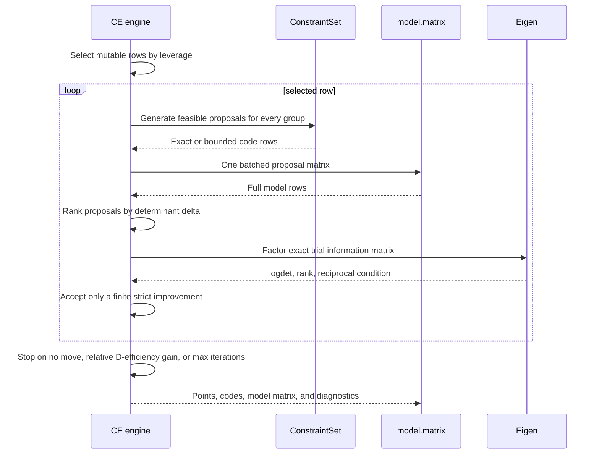
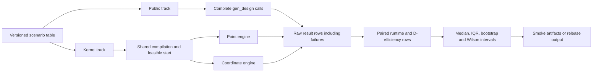

# Coordinate-exchange architecture and benchmarks

The coordinate-exchange implementation keeps formula handling in R and moves
constraint evaluation, feasible-row generation, and D-optimal search into C++.
The internal interfaces are versioned, but they are not public package APIs.

## Constraint compilation and IR v1



Direct factor predicates use level codes. Numeric values are consulted only by
linear atoms, through an original-unit level table indexed by those same codes.
This separates search normalization from constraint semantics.



An empty clause is `TRUE`; zero clauses is `FALSE`. Forbidden tables are
conjoined with the DNF result. All indices and pointers are zero-based inside
the IR.

## Feasible designs and coordinate proposals



The partial evaluator is conservative: it may retain a branch that later turns
out to be infeasible, but it never removes a feasible completion. The final
row evaluator is therefore the sole authority at each leaf.

## One coordinate-exchange sweep



The stopping statistic is
`expm1((logdet_new - logdet_old) / p)`, the relative change in D-efficiency for
one sweep. The returned diagnostics retain the accepted objective history and
the agreement between maintained and independently recomputed log determinants.

## Benchmark workflow



Run the deterministic smoke profile from the package root:

```sh
Rscript inst/benchmarks/run_coordinate_exchange_benchmarks.R \
  --track=all --profile=smoke --output-dir=inst/benchmarks/results
```

Run the full release profile into a non-versioned directory:

```sh
Rscript inst/benchmarks/run_coordinate_exchange_benchmarks.R \
  --track=all --profile=full --output-dir=benchmark-release
```

Both profiles write raw, paired, summary, and provenance files with an explicit
schema version. Every method failure remains a raw and paired result; analysis
never silently drops a failed scenario. The suite is descriptive and makes no
powered inferential claim.
